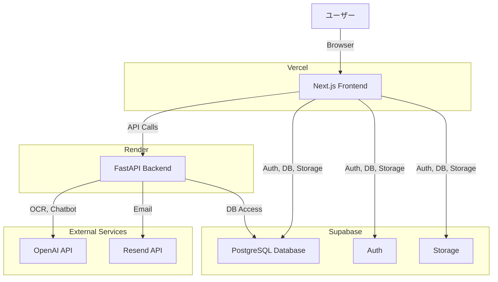

# りんご会♪ 技術仕様書

## 1. 概要

このドキュメントは、「りんご会♪」Webアプリケーションの技術的な仕様を定義します。Claude Codeがこの仕様書を基に、効率的かつ正確に開発を進めることを目的とします。

- **プロジェクト名**: りんご会♪
- **目的**: Amazonの欲しいものリストを交換し合う、ゲーム感覚のコミュニティプラットフォーム
- **ターゲットユーザー**: 10代～30代の女性

---

## 2. 技術スタック

| 用途 | サービス/ライブラリ | 説明 |
|---|---|---|
| **フロントエンド** | Next.js (React) | Vercelにデプロイする最新のReactフレームワーク |
| **バックエンド** | Python (FastAPI) | Renderにデプロイする高速なPython APIフレームワーク |
| **データベース** | Supabase (PostgreSQL) | ユーザー認証、データベース、ストレージを提供 |
| **メール送信** | Resend | 登録確認などのトランザクションメールを送信 |
| **UIフレームワーク** | Tailwind CSS | ユーティリティファーストのCSSフレームワーク |
| **OCR検証** | OpenAI GPT-4 Vision API | スクリーンショットの購入情報を自動で読み取る |
| **チャットボット** | OpenAI GPT-4 Turbo API | ユーザーの状態に応じた対話型AIチャット |

---

## 3. アーキテクチャ



---

## 4. データベーススキーマ (Supabase/PostgreSQL)

### `users` テーブル
ユーザーの基本情報と現在の状態を管理します。

```sql
CREATE TABLE users (
    id UUID PRIMARY KEY DEFAULT uuid_generate_v4(),
    email VARCHAR(255) UNIQUE NOT NULL,
    created_at TIMESTAMPTZ DEFAULT NOW(),
    updated_at TIMESTAMPTZ DEFAULT NOW(),

    -- User Flow Status
    status VARCHAR(50) DEFAULT 'registered', -- registered, terms_agreed, tutorial_completed, ready_to_purchase, verifying, ready_to_draw
    terms_agreed_at TIMESTAMPTZ,
    tutorial_completed_at TIMESTAMPTZ,
    wishlist_url TEXT,
    wishlist_registered_at TIMESTAMPTZ,

    -- Apple Economy
    apple_draw_rights INT DEFAULT 0, -- りんごを引ける権利の数
    purchase_obligation INT DEFAULT 0, -- 購入義務の数
    purchase_available INT DEFAULT 0, -- 購入免除の数（チケット）

    -- Referral & Anti-abuse
    referral_code VARCHAR(10) UNIQUE,
    referred_by UUID REFERENCES users(id),
    referral_count INT DEFAULT 0,
    silver_gold_completed_count INT DEFAULT 0,
    last_silver_gold_completed_at TIMESTAMPTZ
);
```

### `purchases` テーブル
購入トランザクションと検証状態を管理します。

```sql
CREATE TABLE purchases (
    id SERIAL PRIMARY KEY,
    purchaser_id UUID NOT NULL REFERENCES users(id),
    target_user_id UUID NOT NULL REFERENCES users(id),
    target_wishlist_url TEXT NOT NULL,
    target_item_name TEXT NOT NULL,
    status VARCHAR(50) DEFAULT 'pending', -- pending, submitted, approved, rejected
    screenshot_url TEXT,
    created_at TIMESTAMPTZ DEFAULT NOW(),
    verified_at TIMESTAMPTZ,
    admin_notes TEXT
);
```

### `apples` テーブル
りんごの抽選結果と公開状態を管理します。

```sql
CREATE TABLE apples (
    id SERIAL PRIMARY KEY,
    user_id UUID NOT NULL REFERENCES users(id),
    purchase_id INT NOT NULL REFERENCES purchases(id),
    apple_type VARCHAR(50) NOT NULL, -- bronze, silver, gold, red, poison
    draw_time TIMESTAMPTZ DEFAULT NOW(),
    reveal_time TIMESTAMPTZ, -- draw_time + 24 hours
    is_revealed BOOLEAN DEFAULT FALSE,
    is_consumed BOOLEAN DEFAULT FALSE -- For silver, gold, red tickets
);
```

### `referrals` テーブル
友達紹介の履歴を管理します。

```sql
CREATE TABLE referrals (
    id SERIAL PRIMARY KEY,
    referrer_id UUID NOT NULL REFERENCES users(id),
    referred_id UUID NOT NULL REFERENCES users(id),
    created_at TIMESTAMPTZ DEFAULT NOW()
);
```

---

## 5. バックエンド API (FastAPI on Render)

### エンドポイント一覧

- `POST /api/purchase/start`: 購入対象の欲しいものリストを取得
- `POST /api/purchase/verify`: スクリーンショットをアップロードして検証を依頼
- `POST /api/apple/draw`: りんごを引く（24時間後に結果がわかる）
- `GET /api/apple/result/{apple_id}`: りんごの結果を取得
- `POST /api/apple/consume/{apple_id}`: 購入免除チケットを使用
- `POST /api/chatbot`: りんごちゃんチャットボットからの質問に回答

### バッチ処理
- `POST /api/batch/update-rtp`: 1日1回、動的RTPを計算して確率を更新

### 管理者用エンドポイント
- `GET /api/admin/users`: ユーザー一覧を取得
- `PUT /api/admin/users/{user_id}`: ユーザー情報を更新
- `POST /api/admin/users/{user_id}/grant-red-apple`: 赤いりんごを手動で付与
- `GET /api/admin/verifications`: 検証待ちの購入一覧を取得
- `POST /api/admin/verifications/{purchase_id}`: 購入を承認/却下

---

## 6. フロントエンド (Next.js on Vercel)

### ディレクトリ構造

```
/app
  / (pages)
    / layout.js
    / page.js (Home)
    / login/page.js
    / register/page.js
    / dashboard/page.js
    / draw/page.js
    / friends/page.js
    / admin/page.js
  / components
    / AppleCard.js
    / AppleReveal.js
    / Chatbot.js
    / Countdown.js
    / Header.js
    / UserFlowGuard.js
  / lib
    / supabase.js
    / user.js (ユーザー状態管理フック)
/public
  /images
    / ... (イラスト・アイコン)
```

### ユーザーフローの実装

`UserFlowGuard.js`コンポーネントを作成し、各ページでユーザーの`status`をチェックします。条件を満たさない場合は、適切なページにリダイレクトします。

```javascript
// components/UserFlowGuard.js
import { useUser } from 
'@/lib/user
';
import { useRouter } from 
'next/navigation
';
import { useEffect } from 
'react
';

const UserFlowGuard = ({ children, requiredStatus }) => {
  const { user, isLoading } = useUser();
  const router = useRouter();

  useEffect(() => {
    if (isLoading) return;
    if (!user) {
      router.push(
'/login
');
      return;
    }

    const statusOrder = [
      'registered',
      'terms_agreed',
      'tutorial_completed',
      'ready_to_purchase',
      'verifying',
      'ready_to_draw'
    ];

    const currentUserIndex = statusOrder.indexOf(user.status);
    const requiredIndex = statusOrder.indexOf(requiredStatus);

    if (currentUserIndex < requiredIndex) {
      // ユーザーはまだこのステップに到達していない
      // 前のステップにリダイレクト
      switch (user.status) {
        case 'registered':
          router.push(
'/terms
');
          break;
        case 'terms_agreed':
          router.push(
'/tutorial
');
          break;
        // ... 他のケース
        default:
          router.push(
'/dashboard
');
      }
    }
  }, [user, isLoading, router, requiredStatus]);

  // 条件を満たしている場合のみ子コンポーネントを表示
  return <>{children}</>;
};

// 使用例: /app/draw/page.js
export default function DrawPage() {
  return (
    <UserFlowGuard requiredStatus="ready_to_draw">
      <h1>りんごを引くページ</h1>
      {/* ... */}
    </UserFlowGuard>
  );
}
```

---

## 7. デザインシステム (Tailwind CSS)

`tailwind.config.js`にカラーパレットとフォントを設定します。

```javascript
// tailwind.config.js
module.exports = {
  // ...
  theme: {
    extend: {
      colors: {
        'ringo-pink': '#FFC0CB',
        'ringo-purple': '#E6E6FA',
        'ringo-red': '#FF6347',
        'ringo-gold': '#FFD700',
        'ringo-silver': '#C0C0C0',
        'ringo-bronze': '#CD7F32',
        'ringo-poison': '#8A2BE2',
      },
      fontFamily: {
        logo: ['YourLogoFont', 'sans-serif'], // ロゴ用フォント
        body: ['Hiragino Kaku Gothic ProN', 'sans-serif'], // 本文用フォント
      },
    },
  },
  // ...
};
```
